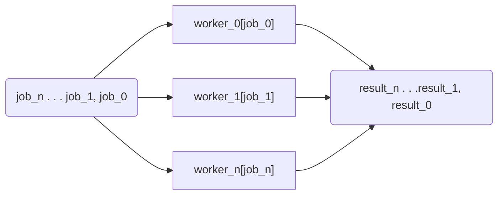

[](https://github.com/esdatalabs/workforce/actions/workflows/ci.yml)

# Workforce
Barebones implementation of the worker pool (Fan Out/In) pattern in go

## Fan Out/Fan In



## Installation

```sh
go install github.com/esdatalabs/workforce@latest
```

## Usage

[Batch Processing](./examples/batches/README.md)
